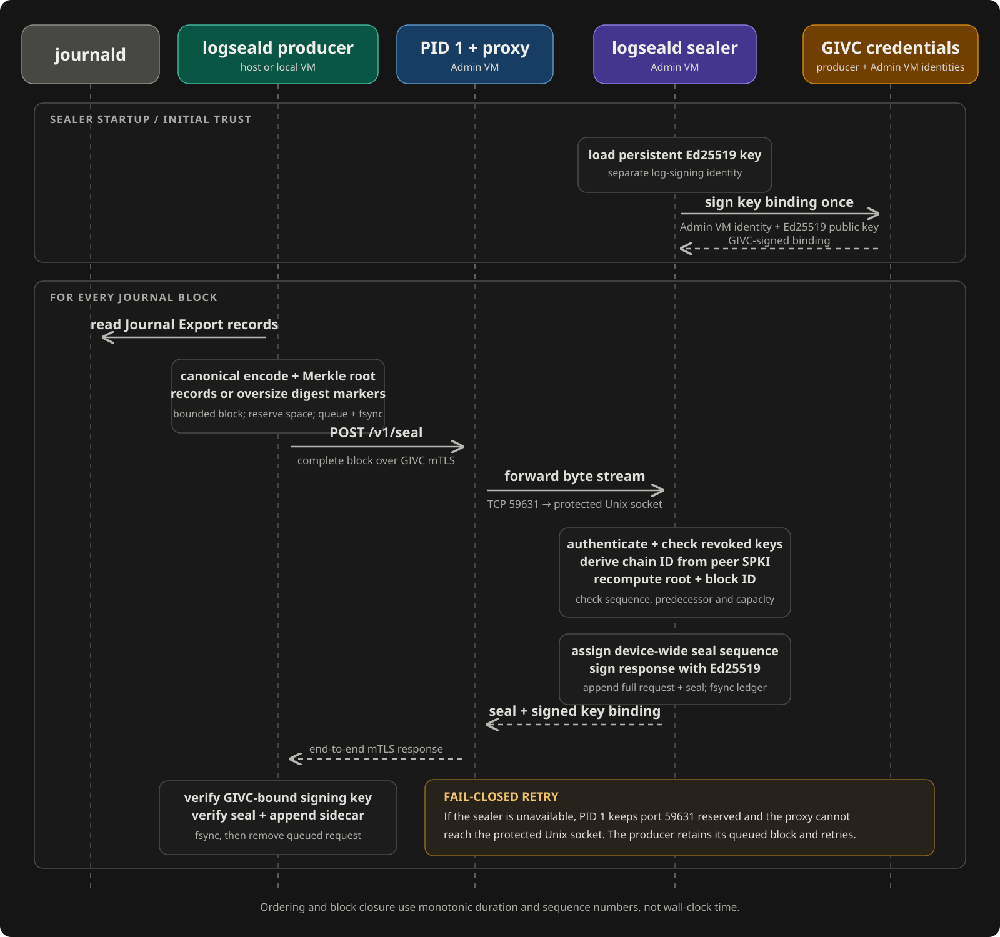

Ghaf uses `logseald` to provide clock-independent tamper evidence for system
and audit logs. Every logging-enabled component seals records from its local
journal. The Admin VM validates and signs those component chains.

Log sealing protects integrity. It does not encrypt log content. Logs remain
readable through `journalctl` and remain available in Grafana.

## Architecture

The host and every logging-enabled virtual machine run a producer. The Admin
VM runs a producer for its own journal and the central sealer for all producers.

```text
Host journald --------> Host producer ---------+
System VM journald ---> System VM producer ----+-- mTLS --> Admin VM sealer
Application VM journal > Application producer -+                 |
Admin VM journald ----> Admin VM producer -----+                 v
                                                       Signed central ledger
```

The following sequence shows the initial trust binding and the complete path of
one journal block through the current implementation:



_Figure 1. The current logseald sequence. The producer queues a complete block
before sending it. The sealer independently validates and persists the block
before returning a verifiable seal._

The current software signing backend uses a persistent Ed25519 key. A TPM or
TEE signing backend is not part of this flow.

Each producer seals records before the normal journal forwarding path
aggregates them. Log forwarding and log sealing therefore remain independent.
An unavailable remote logging service does not stop local sealing.

### Producer

The producer reads the local journal export stream. Journal records can contain
binary values and duplicate fields, so the producer uses a binary-safe
canonical encoding instead of a text or map representation.

The producer groups records into blocks. Each block contains:

- Authenticated producer chain identifier
- Component name
- Producer sequence number
- Previous block identifier
- Boot identifier
- First and last journal cursors
- Canonical journal records
- Merkle root of the records

The producer writes the complete block into its durable queue before it advances
the recoverable journal cursor. This ordering prevents an acknowledged cursor
from referring to a block that was never stored.

### Sealer

The producer sends the complete block to the sealer over mutually authenticated
TLS. The sealer does not sign an opaque producer-supplied digest. It decodes the
block and recomputes its canonical representation, Merkle root, and block
identifier.

The sealer binds the chain to the authenticated GIVC certificate. It then checks
the producer sequence and predecessor against the accepted chain head. An
accepted block receives a device-wide seal sequence and an Ed25519 signature.
The sealer persists the complete request and signed response before replying.

The sealer signs a domain-separated binding between its Ed25519 signing key and
the authenticated GIVC transport identity. The producer verifies this binding
against the server certificate from the TLS connection before it pins the
signing key or accepts a seal. It persists the sealed artifact before deleting
the queued request. Identical retries return the original seal and do not create
another ledger entry.

## Clock-Independent Operation

Block order, block closure, chaining, and signing do not depend on wall-clock
time. The block interval uses process duration rather than realtime. Sequence
numbers provide the security order.

Logseald uses the `static-cert` TLS time policy by default. This policy verifies
the certificate authority, peer name, signatures, and key usage at a time within
the certificate chain validity interval. It does not trust the device clock and
does not enforce certificate expiration. Certificate replacement and revocation
are deployment responsibilities.

If the Admin VM is unavailable, producers continue to create chained blocks in
their durable queues. At the configured queue limit, a producer stops consuming
new journal entries and retries the oldest block. Journald retains records that
have not reached the producer queue, subject to the configured journal retention
limits.

## Identity and Key Separation

Logseald reuses the GIVC public key infrastructure for transport authentication:

```text
/etc/givc/ca-cert.pem
/etc/givc/cert.pem
/etc/givc/key.pem
```

Systemd passes these files to each unprivileged logseald service as private
credentials. The SHA-256 fingerprint of the authenticated certificate public
key identifies the producer chain.

The GIVC CA and the exact `admin-vm` certificate identity are the initial root
of trust. The GIVC key authenticates the network endpoint and certifies the
separate Ed25519 log-signing key once per sealer start. It does not sign each log
block. The sealer stores the Ed25519 key at:

```text
/var/lib/logseald/sealer/sealer.key
```

Separating these roles prevents a log-signing operation from becoming a general
GIVC identity operation.

## Network Boundary

The sealer process does not own the TCP port. PID 1 continuously owns port
`59631` on the Admin VM's internal GIVC address and activates an unprivileged
systemd socket proxy. The proxy forwards the byte stream to a protected Unix
socket owned by the sealer. If the sealer stops or crashes, the TCP port remains
reserved, proxy connections fail closed, and producers retain blocks in their
durable queues.

The Ghaf firewall removes this port from the generic allow-list and admits new
connections only from the configured internal Ghaf node addresses. This source
filter limits exposure but is not producer authentication: every request must
still complete mTLS and the sealer binds the block chain to the authenticated
certificate public key.

## Configuration

Logseald is enabled by default when global logging is enabled. Disable it across
the host and all virtual machines with:

```nix
ghaf.global-config.logging.logseald.enable = false;
```

Disabling the service preserves producer and sealer state. It does not disable
journald, Fail2Ban, journal forwarding, Grafana, or the FSS implementation.

The central sealer listens on TCP port `59631`. Configure a different port with:

```nix
ghaf.global-config.logging.logseald.port = 59631;
```

The feature requires global logging, GIVC, and GIVC TLS. The component-level
module exposes these settings under `ghaf.logging.logseald`:

| Option | Default | Purpose |
| --- | --- | --- |
| `producer.blockRecords` | `256` | Maximum records in one block |
| `producer.blockIntervalSeconds` | `5` | Maximum duration of an in-memory block |
| `producer.maxPendingBlocks` | `64` | Durable blocks retained while the sealer is unavailable |
| `producer.retryIntervalSeconds` | `2` | Delay between delivery attempts |
| `endpoint.port` | `59631` | Sealer TCP port |
| `endpoint.serverName` | `admin-vm` | Expected GIVC certificate identity |
| `tls.timePolicy` | `static-cert` | Certificate time validation policy |

## Services and State

| Component | Service | State directory |
| --- | --- | --- |
| Host producer | `logseald-producer.service` | `/persist/common/logseald/producer` |
| VM producer | `logseald-producer.service` | `/var/lib/logseald/producer` |
| Admin VM sealer | `logseald-sealer.service` | `/var/lib/logseald/sealer` |
| Admin VM listener | `logseald-sealer.socket`, `logseald-sealer-proxy.service` | `/run/logseald-sealer/sealer.sock` |

Producer state contains queued requests, sealed artifacts, and the pinned
sealer public key. The central state contains the Ed25519 signing key and the
append-only ledger. VM state is persisted through the Storage VM when storage
persistence is enabled.

## Verify a Deployment

### Host Producer

Check the service:

```console
sudo systemctl is-active logseald-producer.service
sudo systemctl status logseald-producer.service --no-pager
sudo journalctl -b -u logseald-producer.service -n 50 --no-pager -l
```

Verify the host chain and signatures:

```console
sudo logseald verify-producer \
  --state-dir /persist/common/logseald/producer \
  --cert /etc/givc/cert.pem \
  --source "$(hostname)"
```

### Admin VM

In the Admin VM, check the services, socket, and listener:

```console
sudo systemctl is-active logseald-producer.service logseald-sealer.service logseald-sealer.socket
sudo ss -ltnp | grep -F ':59631'
```

Verify the Admin VM producer and central ledger:

```console
sudo logseald verify-producer \
  --state-dir /var/lib/logseald/producer \
  --cert /etc/givc/cert.pem \
  --source "$(hostname)"

sudo logseald verify-sealer --state-dir /var/lib/logseald/sealer
```

Successful verification reports `PASS` and the number of sealed or queued
blocks. A queued block count of zero means the producer has received seals for
all durable requests.

### Pipeline Marker

Create a unique journal record on the host and wait for the default block
interval:

```console
logseal_state=/persist/common/logseald/producer
before=$(sudo find "$logseal_state/sealed" -type f -name '*.json' | wc -l)

marker="LOGSEAL_PIPELINE_TEST_$(date +%s)"
systemd-cat --identifier=logseald-test echo "$marker"
journalctl -b -t logseald-test -o cat --no-pager | grep -F -- "$marker"

sleep 12
after=$(sudo find "$logseal_state/sealed" -type f -name '*.json' | wc -l)

test "$after" -gt "$before" && echo "PASS: new block sealed"
```

Run `verify-producer` and `verify-sealer` again after this test. Other system
activity can create additional blocks while the commands run.

## Troubleshooting

### Producer Queues Locally

This message means the producer could not reach the sealer:

```text
seal submission unavailable; queueing locally
```

Check the sealer service, sealer socket and proxy units, TCP listener, Admin VM
connectivity, and GIVC credentials. A later `seal submission recovered` message
confirms that delivery resumed. Persistent queued blocks remain under the
producer `queue` directory.

### Verification Fails

Treat a verification failure as an integrity or state-continuity failure. Do not
delete or rewrite the queue, sealed artifacts, pinned key, signing key, or
ledger. Preserve the complete state directories before investigating the first
reported sequence or signature error.

### Certificate Changes

The producer pins the first signing key whose binding verifies under the
authenticated Admin VM GIVC identity. Replacing the Admin VM certificate does
not replace the Ed25519 sealer key; the sealer creates a new binding for the
same signing key. Changing the signing key causes producers to reject seals.
Preserve sealer state across system updates and recovery.

## Security Properties

Logseald detects these changes within retained evidence:

- Modified canonical records
- Incorrect Merkle roots
- Inserted or missing non-trailing blocks
- Reordered blocks
- Incorrect predecessors
- Producer-chain forks
- Changed sealer signatures or public keys

Mutual TLS prevents an unauthenticated node from claiming another GIVC chain
identity. Durable state transitions and idempotent retries preserve one accepted
history across service crashes and network retries.

## Limitations

Logseald does not provide these properties:

- Log confidentiality or encryption at rest
- Proof that applications logged truthful or complete information
- Prevention of log-production denial of service
- Hardware-backed protection for the Ed25519 signing key
- Detection when the software key and complete trailing ledger state are rolled back together
- Certificate expiration or revocation enforcement under `static-cert`
- Protection after compromise of the Admin VM GIVC private key or CA
- Port reservation if the socket unit or PID 1 is stopped by an administrator
- Automatic pruning of full producer and sealer evidence
- Global Merkle inclusion or consistency proofs for the central ledger

The producer and sealer retain complete canonical journal records. Protect these
directories as sensitive log storage and account for their growth in storage
capacity planning.

## Related Reading

- [System Logs](/ghaf/overview/arch/system-logs-encryption/)
- [Forward Secure Sealing](/ghaf/scs/fss/)
- [Global Configuration System](/ghaf/dev/global-config/)
